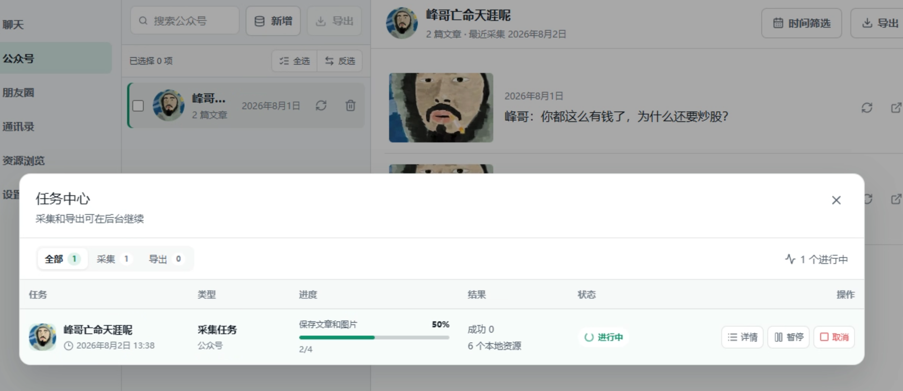

<div align="center">
  
  <h1>Wemory</h1>
  <p>A local-first Windows app for browsing, backing up, and exporting WeChat data</p>
  <p>
    <a href="https://weibocloner.bytefuse.cn">Website</a> ·
    <a href="https://github.com/ftyszyx/wemory-wechat-backup/releases/latest">Latest release</a> ·
    <a href="https://apps.bytefuse.cn/products/4">Purchase</a> ·
    <a href="README.md">简体中文</a>
  </p>
</div>


## What Wemory does

Wemory helps you organize WeChat data on your own computer. It reads and processes data locally and provides focused tools for browsing and exporting:

- Chats: browse direct, group, and business conversations; export to HTML or PDF.
- Moments: browse posts chronologically; export to HTML or PDF.
- Contacts: inspect contacts and export contacts or group members to XLSX.
- Official Accounts: collect, organize, and export Official Account articles in batches.
- Media: view local images, videos, voice messages, and other chat media.

## Local first

WeChat data is read, decrypted, and exported on your computer. Content is not uploaded. Network access is limited to app updates, license activation, and required component downloads. You choose where every export is stored.

## Screenshots

### Official Account collection



### Contacts


## Download and install

1. Download `Wemory_0.1.108_x64-setup.exe` from the latest [Release](https://github.com/ftyszyx/wemory-wechat-backup/releases/latest).
2. Run the installer on Windows 10 or Windows 11 x64.
3. Open Wemory and follow the in-app steps to connect your local WeChat data folder.

The current installer is not code-signed, so Microsoft Defender SmartScreen may display a warning. Download only from this repository's Releases or the product website and verify the checksum:

```text
SHA-256: 4FBF5E4835FBF2F0E0FF1C66D4DED7C6D0BE6459DA2A77368CB2161ACC4E39B3
```

## Requirements

- Windows 10 / 11 x64
- Microsoft Edge WebView2 Runtime
- A Windows WeChat installation with local account data

## Notice

This repository hosts Wemory product information, screenshots, and installers; it does not contain the application source code. Wemory is an independent product and is not affiliated with or endorsed by Tencent or WeChat. Process only data you are authorized to access and comply with applicable laws and service terms.

Please use [Issues](https://github.com/ftyszyx/wemory-wechat-backup/issues) for product feedback.
